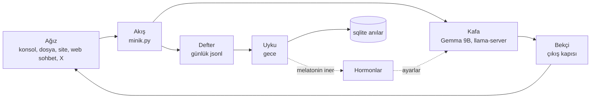

# Minik

Büyüyen bir yapay zekâ denemesi. Minik konuşarak öğrenir, gün içinde konuştuklarını bir deftere
yazar, gece uyuyup bunları pekiştirir. Davranışını yedi "hormon" sayısı ayarlar: merakı, sabrı,
yorgunluğu. Dil modeli Minik'in ağzıdır ve değiştirilebilir; projenin kendine ait kısmı hormon
motoru, hafıza ve uyku.

Her şey tek bir laptopta (RTX 4070 Laptop, 8 GB VRAM) yerel çalışır, bulut harcaması yoktur.

## Durum

- **Çalışıyor:** konsol, dosya ve web sohbet ağızları; Türkçe Gemma 9B ile Kafa; yedi hormon;
  Defter (günlük jsonl + sqlite); Uyku (SM-2 provası, budama, sabah özeti); Bekçi'nin çıkış ve
  giriş kapıları; webden merakla araştırma.
- **Sırada:** eski anıların konuşmaya gelmesi, gece LoRA eğitimi, X'te yaşama.
- Açık iş listesi: [`notes/devam.md`](notes/devam.md) bölüm 3. Kararlar: [`notes/kararlar.md`](notes/kararlar.md).

## Mimari

Yedi yuva ilk günden var, her biri en sade hâliyle. Akış (`minik.py`) sırayı tutar, karar vermez;
kararı ilgili yuva verir.



| Yuva | Ne yapar | Dosya |
| --- | --- | --- |
| Kafa | Soruyu yerel dil modeline sorar; hormonları örnekleme ayarına çevirir | `yuvalar/kafa.py` |
| Hormonlar | Yedi sayıyı olaylara göre günceller, kalıcı tutar | `yuvalar/hormonlar.py`, `duygu.py`, `ton*.py` |
| Bekçi | Çıkışta emniyet ve karakter kapısı; girişte "üç bağımsız kaynak" kuralı | `yuvalar/bekci.py`, `bekci_giris.py` |
| Defter | Ham konuşmayı günlük jsonl'e yazar, son kayıtları bağlama verir | `yuvalar/defter.py`, `defter_sqlite.py` |
| Uyku | Yorulunca günü işler: etiket, prova, budama, sabah özeti | `yuvalar/uyku.py`, `uyku_secim.py`, `uyku_tetik.py` |
| Kalp | Refleks önerir (şimdilik gölge modda, yalnız loglanır) | `yuvalar/kalp.py` |
| Çalgıcılar | Hesabı Python yapar, iki yoldan doğrular | `yuvalar/calgicilar.py`, `calgici_tani.py` |

Ayrıntılı tasarım ve gerekçeler: [`docs/superpowers/specs/2026-09-21-minik-mimari-design.md`](docs/superpowers/specs/2026-09-21-minik-mimari-design.md).

## Klasörler

| Klasör | İçerik |
| --- | --- |
| `minik.py` | Giriş noktası, sohbet döngüsü |
| `yuvalar/` | Yedi yuva |
| `agiz/` | Platform bağımsız ağızlar (konsol, dosya, site, web sohbet, web arama, X) |
| `ortak/` | Ayarlar, log, bağlam bütçesi, sunucu ve GPU sıcaklık yardımcıları |
| `araclar/` | İşletme araçları: GPU bekçisi, karne, X girişi, model indirme |
| `deneyler/` | Tek seferlik ölçüm betikleri ve sonuç verileri (sonuçlar `reports/` içinde) |
| `tests/` | Birim testleri |
| `notes/` | Canlı notlar: iş kuyruğu, kararlar, kurallar, öğrenilenler |
| `reports/` | Ölçüm ve araştırma raporları |
| `site/`, `karne-site/`, `sohbet-site/` | Karar masası, karne ve sohbet sayfaları (Vercel) |

## Çalıştırma

Çekirdek yalnız Python standart kütüphanesiyle çalışır (Python 3.13). Kafa için
[llama.cpp](https://github.com/ggml-org/llama.cpp) `llama-server` ve bir GGUF model gerekir.

```powershell
# Modeller varsayılan olarak C:\Projelerim\modeller altında aranır; başka yerdeyse:
$env:MINIK_MODEL_KLASORU = "D:\modeller"

# Konsoldan konuş (llama-server 127.0.0.1:8080'de açık olmalı)
python minik.py

# Web sohbet: Kafa'yı GPU'da kendisi açar, 60 dk sessizlikte kapatır
python -m agiz.web_sohbet

# Testler
python -m pytest -q
```

İsteğe bağlı paketler `requirements.txt` içinde (testler, web arama, ölçümler için).

## Kurallar

- Minik'in defteri, loglar ve model ağırlıkları repoya girmez (`.gitignore`).
- X içeriği hafızaya girer ama eğitim verisine girmez; telifli içerik eğitim verisi olmaz.
- Kod kuralları: [`notes/kod-yazma-kurallari.md`](notes/kod-yazma-kurallari.md).
